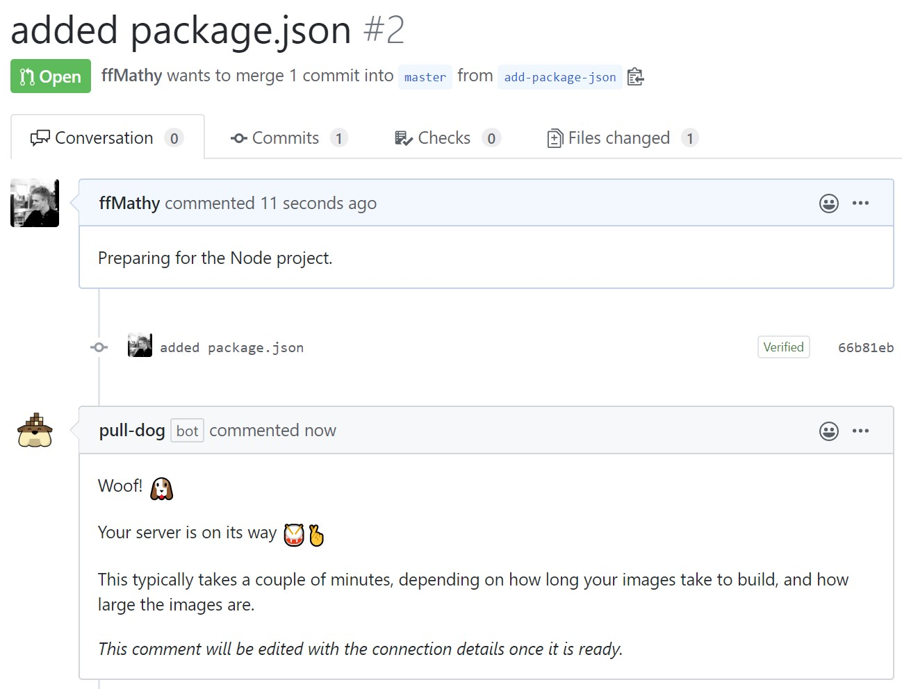
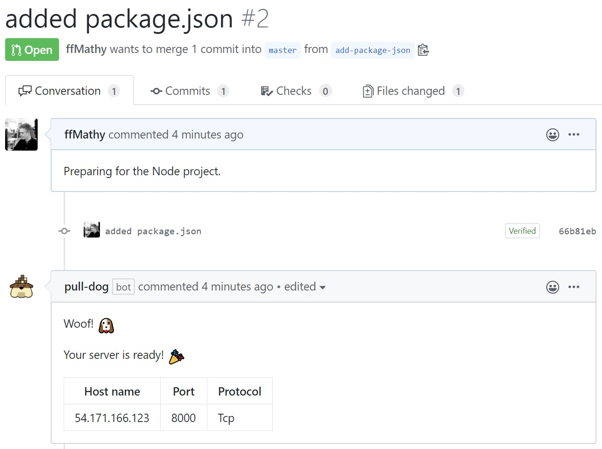
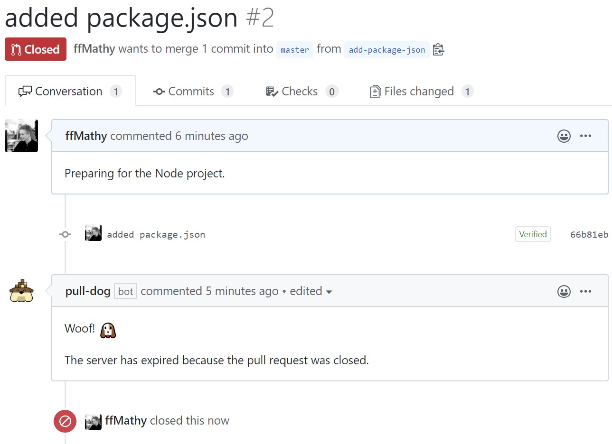

Today, almost every developer is using a managed Git service like GitHub. When writing code, this is almost essential, no matter if you're alone or in a team.

But there are many ways to organize code. What I've seen most people do is to branch out when they make a new feature, and create a "Pull Request" when they have finished that feature.

This allows for several benefits:
- Someone can review the code before it is merged.
- Someone can clone the code and test it on their machine, to make sure nothing broke.

But that second step can be quite tedious and annoying, especially if the person that needs to test the feature is not a developer.

This is where Pull Dog comes in to play.


Pull Dog is a GitHub app that will automatically provision a Docker-based test server for your feature as you open a pull request. And best of all - *it's all free!*

### Setting it up
You start out by <a href="https://github.com/apps/pull-dog" target="_blank" rel="nofollow noopener noreferrer">installing the app</a> to your GitHub account.

Once installed, you simply push a commit to the master branch of the repository you want to enable, with a pull-dog.json file in the root directory that contains the following.

```json
{
    "dockerComposeYmlFilePaths": [
        "your/path/to/docker-compose.yml"
    ]
}
```

After pushing, Pull Dog is enabled for the given repository and will run for any future pull requests that are opened.

### Trying it out
For my example, I made an empty repository with the following pull-dog.json configuration file:

```json
{
    "dockerComposeYmlFilePaths": [
        "docker-compose.yml"
    ]
}
```

And the following docker-compose.yml file, containing a basic WordPress and MySQL setup.

```yaml
version: '3.3'

services:
    db:
        image: mysql:5.7
        volumes:
            - db_data:/var/lib/mysql
        restart: always
        environment:
            MYSQL_ROOT_PASSWORD: somewordpress
            MYSQL_DATABASE: wordpress
            MYSQL_USER: wordpress
            MYSQL_PASSWORD: wordpress

    wordpress:
        depends_on:
            - db
        image: wordpress:latest
        ports:
            - "8000:80"
        restart: always
        environment:
            WORDPRESS_DB_HOST: db:3306
            WORDPRESS_DB_USER: wordpress
            WORDPRESS_DB_PASSWORD: wordpress
            WORDPRESS_DB_NAME: wordpress

volumes:
    db_data: {}
```

#### Opening a pull request
Upon opening my pull request, I am greeted with the following comment from pull-dog where I can see that it is provisioning a server for me.



After a brief while, the comment is updated with the connection details of my server. *Note that the port 8000 is the exposed port from the docker-compose.yml file.*



#### Closing the pull request
After closing the pull request, the server is shut down again, and the comment is updated to reflect that.


